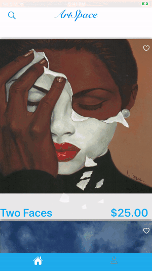
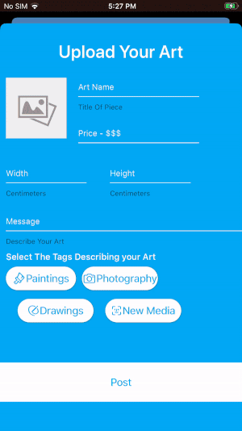

# ArtSpace 

### Introduction
ArtSpace is an immersive app where users can browse art available for sale and even preview on their walls. Independent artists can post their art and make it available for sale. Shoppers can view art and use an innovative augmented-reality feature to see how it would look in their home.

## Features
# Augemented reality shopping experience. 

# In-app purchases Using Stripe
 
# Save Your Card Information  
 
# Post Your Own Art 
 
# Save Art To Purchase Later 

## Technology Stack
- ARKit
- Stripe
- UIKit
- Firebase 
## Stripe Backend 
[Built in Node.Js using Firebase Cloud Functions](https://github.com/atj3097/ArtSpaceBackend)
## Instructions On Installation
* Git Clone 
* Pod install In Terminal(All CocoPods are already in the PodFile) 
* [Download Our Firebase Plist](https://mega.nz/file/YRwFTCyA) 
* Decryption Key - H6J72Q32XT2Dv__c_NNdIvHJ8uitIinWOY95-dSXDyM
* Right click 'Add Files' on the project folder while xcode is open to add the Plist to the project
* Build and Run app 
* Checkout and purchase some great art!
